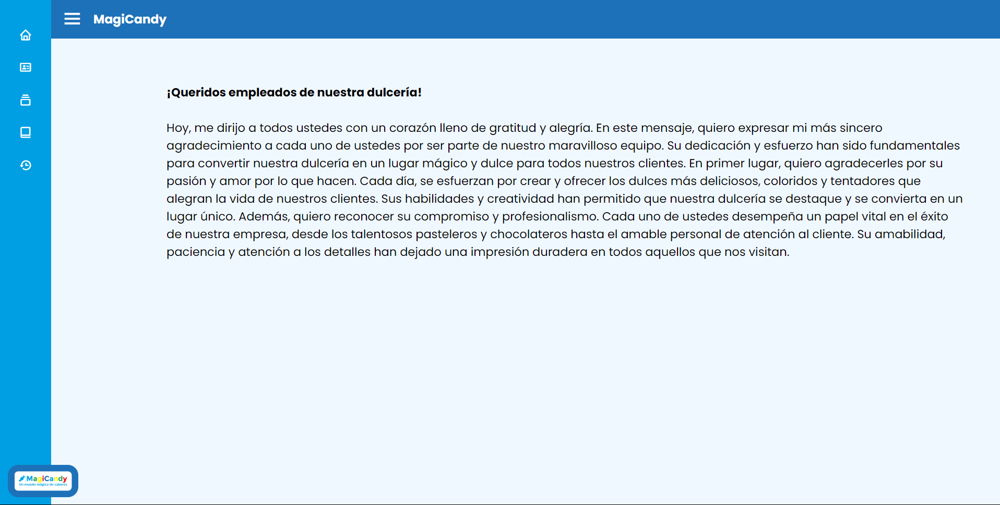
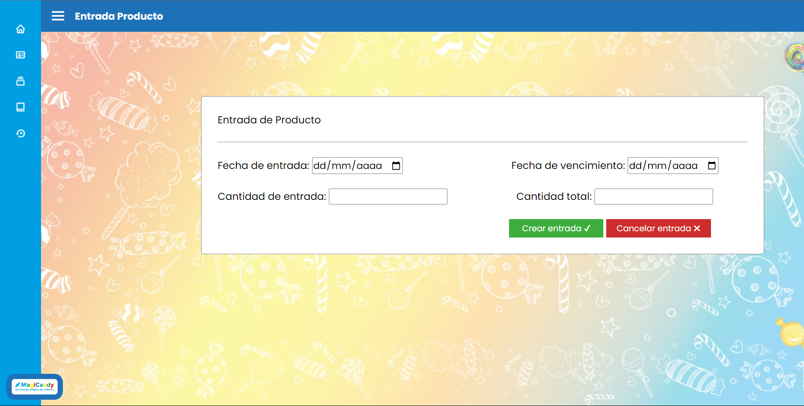
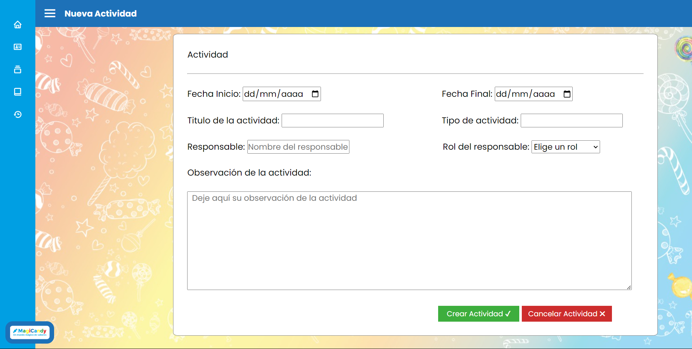

# Sistema de Gestión: Ventas, Inventario y Producción

Este proyecto es un sistema desarrollado en **PHP** con **MySQL** para gestionar tres módulos principales: **Ventas**, **Inventario** y **Producción**. Su objetivo es proporcionar una herramienta eficiente para administrar los procesos clave de una empresa.

## Características del Proyecto
### Módulo de Ventas
- Registro de ventas con detalles como cliente, producto y cantidad.
- Visualización de reportes de ventas diarias, mensuales o personalizadas.
- Generación de facturas en formato PDF.

### Módulo de Inventario
- Control de existencias de productos.
- Actualización automática del inventario tras cada venta.
- Alertas para niveles bajos de stock.

### Módulo de Producción
- Planificación y registro de la producción de productos.
- Gestión de insumos necesarios para la fabricación.
- Reportes de productividad por fecha.

## Tecnologías Utilizadas
- **Lenguaje Backend:** PHP
- **Base de Datos:** MySQL
- **Frontend:** HTML, CSS, JavaScript
- **Framework CSS:** Bootstrap 
- **Bibliotecas Adicionales:** Datatables.js para tablas interactivas, SweetAlert para alertas.

## Instalación
1. Clona este repositorio:
   ```bash
   git clone https://github.com/sergioquirogab/magicandy.git

## Algunas de las páginas iniciales


## Paginas de admin




